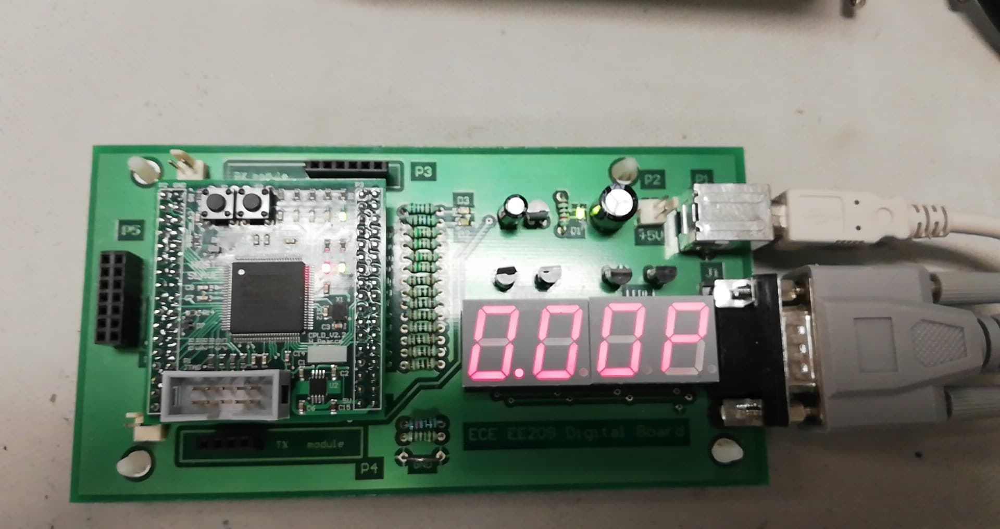
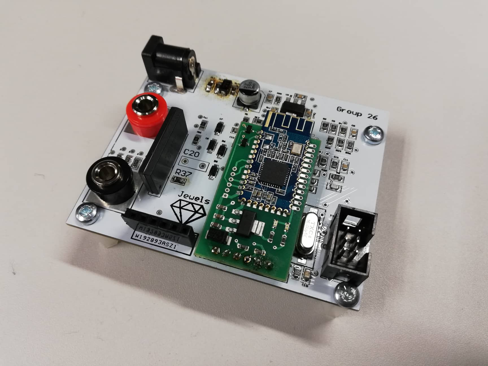
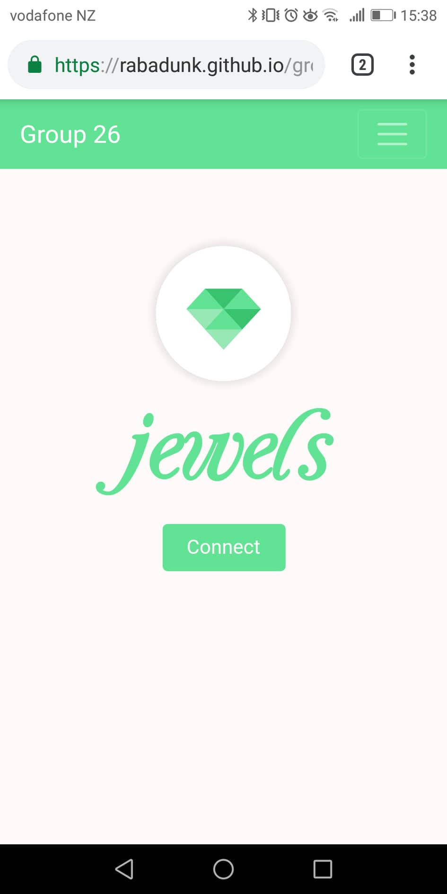
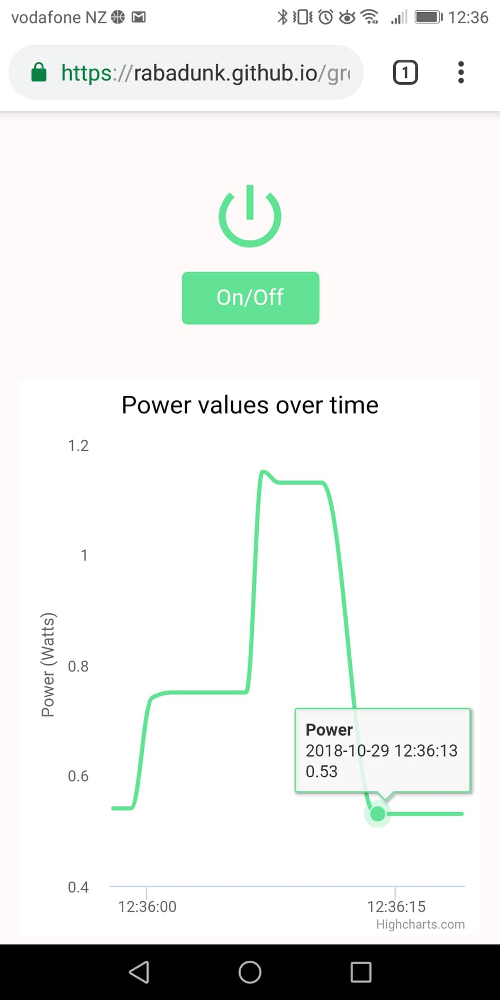
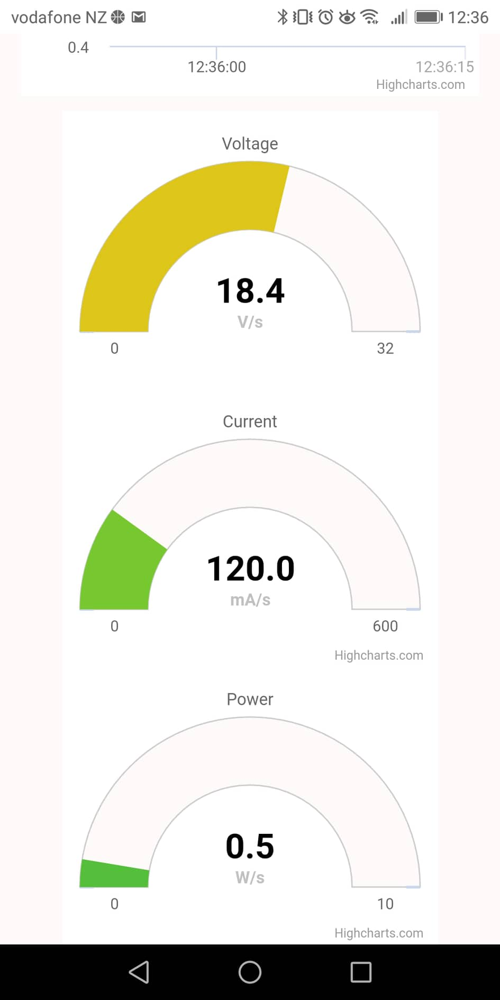

# Jewels

An energy monitor web application designed in parallel with an energy monitor device made for the the University of Auckland course ELECTENG209.

## Project overview

Depletion of fossil fuels, irresponsible and inefficient utilization of energy and consequent adverse impacts on the environment are current global concerns. These concerns have lead to a global awareness of renewable generation and sustainable utilization of energy, in an attempt to reduce the reliance on oil, coal and gas to generate electricity.Consequently, billions of dollars are being invested worldwide in energy-related research and development projects in search for efficient, cost-effective, and reliable technologies. Fueled by the significant investments made in the energysector, the global renewable energy capacity has steadily increased over the last decade. 

To further promote the widespread use of renewable energy, effective new technologies such as decentralized energy generation  (DEG), smart houses and smart grids have been introduced recently. However, these new technologies essentially require some form of smart monitoring aswell as control subsystems to allow for efficient generation and sustainable use of energy. The goal of this project, therefore, was to design and develop a wireless energy monitor to measure and display the amount of energy consumed by an appliance in a smart house. During this project we worked as part of a design team of four students, who undertook an investigation and subsequently developed a prototype energy monitor.

## Energy Monitor Device

As mentioned previously, the goal of this project was to design and implement a system to measure the voltage, current and power supplied to a load, for example a  household appliance, and wirelessly transmit this data to a base station to be displayed. Due to safety reasons, we worked with a scaled-down system, and the labs were equiped with appropriate low voltage AC power sources and variable loads with following specifications:

* Source voltage –14to 15VRMS
* Source frequency –1kHz ± 10%
* Loadrange –2VA to 7.5VA

The wireless energy monitor, that wwas be developed during the course, consisted of two subsystems, a signal  measurement  unit  and  a  base  station,  which communicated  with  each  other  wirelessly  through Bluetooth. Images of both can be seen below.

### Base Station

### Measurement Unit

## Energy Monitor Web App

We were able to attain two bonus marks if we completed the development  of  a  mobile  application to  display  the  energy usage data transmitted by the BLE module of the measurement unit. The application was required to have an intuitive user interface to allow users to connect with the measurement unit and see real-time power, voltage and current. Our application is hosted on github pages, the link to which is above, but images showing the app working can be seen below.

### Intuitive interface to connect to measurement unit

  

### Displays change in power consumption over time

  

### Displays real-time power, voltage and current

  

